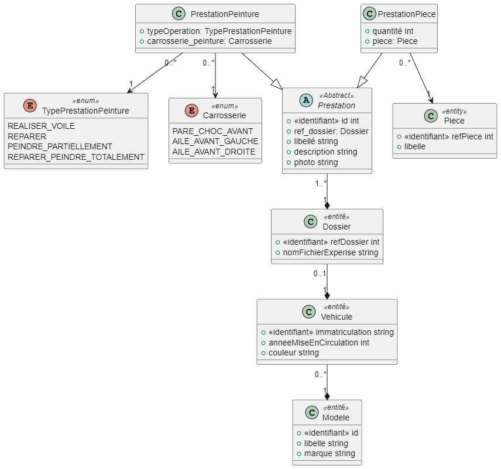
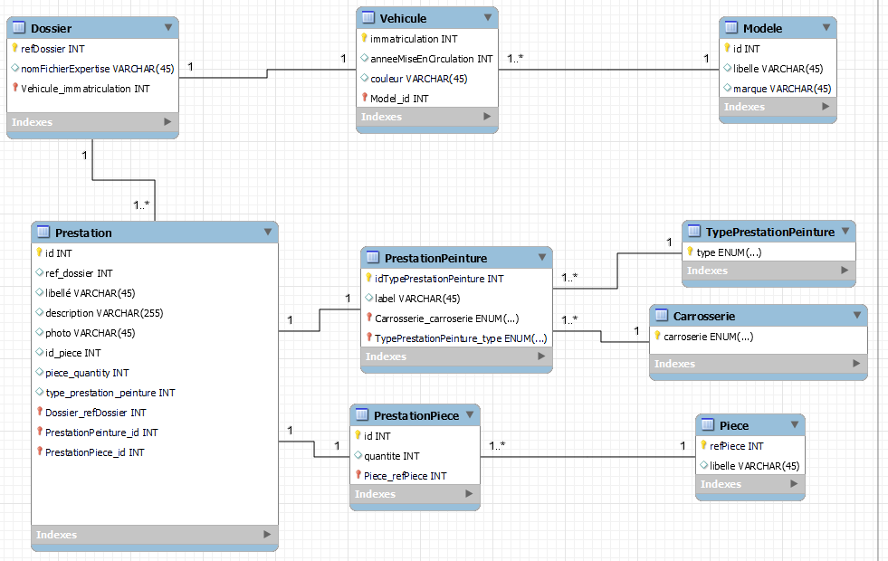

# HUBERT Clément

# EPREUVE UML/DATA FSD 40 3WA

## Mission 1 - Gestion des prestations de remise en état (PREE)

**Question 1.1 Proposer une modification de la structure de la base de données pour intégrer la gestion des PREE.**

* Diagramme de classe modifié : voir fichier torapix_diagramme_classe.mwb (en commentaire la justification des cardinalités)

  
* Schéma nouvelle BDD : voir fichier torapix_diagBDD.mwb

## Mission 2 - Gestion des rendez-vous

**Question 2.1 Justifier le choix fait par vos collegues d'utiliser une classe abstraite pour la classe Expertise**

L'utilisation d'une classe abstraite pour la classe Expertise ce justifie par la logique métier. En effet, la classe expertise correspond aux RDV que RestiLoc peut effectuer pour le compte de ses clients sociétés de financement.

Or, il existe deux types de rendez-vous : le rendez-vous client et le pool garage.

Ces deux types de rendez-vous, ont en commun une multitude de propriétés et de méthodes à l'exception d'une methode exclusive pour le rdv "pool garage" et de trois propriété et une méthode supplémentaire pour le RDV "client".

Pour éviter une répétition de deux classes similaires, comme c'est le cas en l'espèce, on peut utiliser une classe abstraite qui va permettre de définir une structure de base. Les classes Pool_Garage et RDV_Client n'auront plus qu'à hériter de cette classe abstraite tout en spécifiant chacune ses propriétés et méthodes exclusives.

En conclusion, l'utilisation d'une classe abstraite Expertise se justifie pour des besoins de définition d'une structure de base permettant d'avoir un code plus lisible et maintenable.

**Question 2.2 Implémentez le diagramme de classe.**

    => voir fichier gestion_rdv.php

## Mission 3 - Application mobile pour les experts

Question 3.1 Ecrire en language SQL les requêtes permettant d'obtenir les informations souhaitées.

    => Voir fichier application_mobiles_requetes.sql

Question 3.2 Ecrire en language SQL les requêtes permettant :

* De créer les tables et les clés étrangères (contraintes d'intégrités)
* Ajouter des données dans la BDD
* Supprimer des entrées.

  => Voir fichier application_mobiles_requetes.sql
